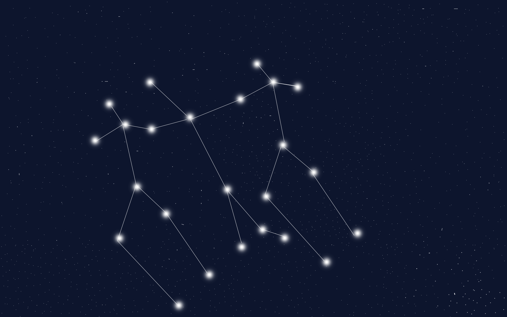

# A Social App for Miniature Painters

## Not like, painters who are miniature.

### But, you know, painters who like to paint miniatures.
   

# About us

Cem Ayteac; Jam Wheat; Alexandria Stephenson
## About Chrominia
Chrominia was built in Unit 3 of our Software Engineering Immersive at General Assembly. Unit 3 was primarily focused on learning React and its role in a MERN-stack application. An additional requirement was implementing token-based authentication.
  

# Technologies Used
* React
* NPM
* JavaScript
* HTML
* CSS
* Bootstrap
* Trello
* Whimsical
* Heroku
* Pixelmator
  

# Getting Started
[Chrominia is currently hosted by Heroku](https://chrominia.herokuapp.com/)  
[You can view our Trello board](https://trello.com/b/8wIUmzpN/chrominia)

# Screenshots

# Attributions
Supplies icons were sourced from [The Noun Project](https://thenounproject.com/) 
- **Model Icon**: warrior by NAMIRUS from the Noun Project  
- **Materials Icon**: grass By coer, RU  
- **Miscellaneous Icon**: Solid Ampersand by Kristin Burrows from the Noun Project  
- **Paint Accessories Icon**: paint by Gregor Cresnar from the Noun Project  
- **Paint Icon**: paint by iconfield from the Noun Project  
- **Brushes Icon**: paint by DinosoftLab from the Noun Project  
- **Tools Icon**: clippers by prasong tadoungsorn from the Noun Project

Color palette was sourced from [Coolers](https://coolors.co/).
